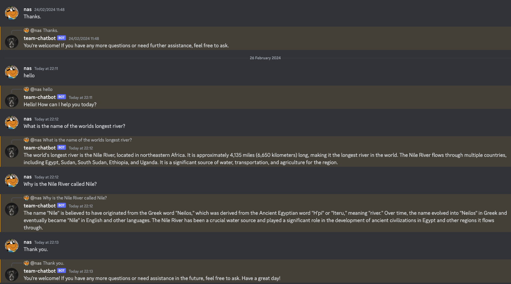

   
# Discord OpenAI Chat Bot


## Description
This project was developed as part of the FAC - FAC30A (Founders and Coders) curriculum. The aim of the project was to create a Discord Chat Bot with OpenAI inregrated with the server.

The project is built using JavaScript, Node/Nodemon, Discord.js, OpenAI and Jest as a testing library, reflecting FAC's commitment to foundational technologies. Despite facing challenges, such as a change in personnel during development, the team successfully navigated through obstacles.

The development process was not without its share of challenges. Adapting to personnel changes and the need for knowledge transfer created additional complexities. The team had to find efficient ways to maintain project continuity amidst time constraints and differing levels of experience among collaborators.

Example of Discord with OpenAI installed:




## Installation

To install this project on your local machine please follow these steps:

1. For a free API Key at [OpenAI](https://platform.openai.com/api-keys) Platform.
2. Create a bot on [Discord Developers](https://discord.com/developers/applications).
3. Assign the permissions you want the bot to have (ensure you select `bot` and `applications.commands`) and generate a URL
4. Invite your bot to the server you manage by pasting the generated link
5. Copy the Discord Bots 'Channel ID' by right clicking on general in the server menu and adding the Channel ID to the messageHandler.js file, in the Channels array around Line 10.
6. Clone the repo
   ```sh
   git clone https://github.com/fac30/bahja-isaac-nas-discord-chatbot.git
   ```
7. Install NPM packages
   ```sh
   npm install
   ```
8. Enter your API and Discord Token in a `.env` file, please refer to `.env-example` for reference
9. Launch your bot in the terminal so it goes online
  ```sh
    node index.js
  ```

## How to use the project
Once the server is running please interact with the Bot via the text field of the server.

## Credits
Thanks to the following contributors:
- [Isaac GitHub repo](https://github.com/PrinceAyo1?tab=overview&from=2024-01-01&to=2024-01-23)
- [Bahja GitHub repo](https://github.com/bajii2020)
- [Nas GitHub repo](https://github.com/nascho)

We also used the following resources to understand how to use OpenAI's API and Discord.js to create an AI chat bot. This includes official documentation:

* Discord.js [official documentation](https://discordjs.guide/#before-you-begin)
* OpenAI [API documentation](https://platform.openai.com/docs/introduction)
 